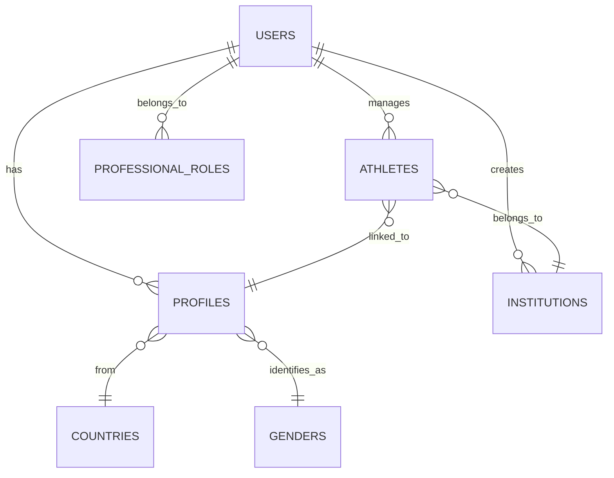

# 🧩 Athlete Management System

## 📘 Overview

The **Athlete Management System** is a modular, containerized API that manages institutions, users, athletes, and related profile data for sports organizations.  
It is designed to centralize athlete records, user, and institutional data while maintaining multilingual flexibility and scalable database access.

This project uses **FastAPI** for the web layer and **Peewee ORM** for database interaction.  
All data is persisted in a **MySQL** database and accessed through structured endpoints.

---

## 🏢 Business Context

This system supports **sports institutions** in organizing and managing their **athletes** and **staff members**.  
Each **institution** associated with a register users (administrators, coaches, etc.), who in turn can manage their athletes and related profile data.

Key entities:
- **Institutions** represent sports organizations.
- **Users** belong to institutions and have professional roles.
- **Profiles** store user and athlete personal data.
- **Athletes** are linked to institutions and profiles.
- **Countries** and **Genders** provide reference dimensions.
- **Professional Roles** define the hierarchy of users.

All entities are interconnected and can be visualized in the **Entity-Relationship Diagram (ERD)** below.

---

## 🗃️ Database Model (ERD)

The database was modeled with **Peewee ORM** and designed to ensure data consistency, normalization, and referential integrity.




## 🚀 API Endpoints

### 🧑‍💼 User Endpoints
| Method | Endpoint | Description |
|--------|-----------|-------------|
| `POST` | `/users/` | Create a user tied to an institution |
| `POST` | `/login/` | Authenticate a user |
| `GET` | `/healthcheck/` | Check API health status |
| `GET` | `/version/` | Retrieve system version |

---

### 🏃‍♂️ Athlete Endpoints
| Method   | Endpoint | Description |
|----------|-----------|-------------|
| `POST`   | `/athletes/` | Create an athlete |
| `GET`    | `/athletes/{id}` | Get athlete by ID |
| `GET`    | `/athletes/email/{email}` | Get athlete by email |
| `GET`    | `/athletes/` | Get all athletes |
| `PATCH`  | `/athletes/{id}` | Update athlete information |
| `DELETE` | `/athletes/{id}` | Delete athlete |
| `POST`   | `/athletes/upload/` | Upload a CSV with athlete data for the user’s institution |

---

### 👤 Profile Endpoints
| Method  | Endpoint | Description |
|---------|-----------|-------------|
| `GET`   | `/profiles/me` | Retrieve user profile |
| `PATCH` | `/profiles/me` | Update user profile |

---

### 🧭 Professional Role Endpoints
| Method | Endpoint | Description |
|--------|-----------|-------------|
| `GET` | `/roles/` | Get all professional roles |

---

### 🏫 Institution Endpoints
| Method | Endpoint | Description |
|--------|-----------|-------------|
| `PUT` | `/institutions/{id}` | Update institution information |

---

### 🚻 Gender Endpoints
| Method | Endpoint | Description |
|--------|-----------|-------------|
| `GET` | `/genders/` | Get gender list |

---

### 🌎 Country Endpoints
| Method | Endpoint | Description |
|--------|-----------|-------------|
| `GET` | `/countries/` | Get list of countries |

---

## 🧱 Project Structure

 ```
 app/
├── models/                 # Database models (Peewee ORM)
├── routers/                # FastAPI route definitions
├── services/               # Business logic separated from routes
├── schemas/                # Pydantic models for request/response validation
├── utils/                  # Reusable utilities and helpers
├── resources/
│   ├── postman_collection.json   # Example API collection
│   ├── database.sql              # MySQL schema
│   ├── erd_block.png             # ER diagram image
│   └── athletes_dataset.csv      # Example dataset (parsed before insert)
├── wait-for-it.sh                # Wait for DB before API start
├── start.sh                      # Launch FastAPI app
│
├── Dockerfile
├── docker-compose.yml
├── .env
└── main.py                       # FastAPI entrypoint
 ```

## 🛠️ Application Behavior

- The database is **automatically initialized** on startup if it doesn’t exist.
- A **seed script** loads essential data (countries, genders, roles).
- Logging is colorized for clearer debugging and log analysis.
- Middleware handles:
  - Automatic **database reconnection**
  - **Language localization**
- A **decorator** is available to apply pagination on list endpoints.
- authentication using **JWT**

---

## 🧾 Dataset Description

The provided CSV dataset (`resources/athletes_dataset.csv`) contains sample athletes linked to an institution.  
When uploaded through the API:
- The `birthdate` column is parsed into ISO `DATE` format.
- Each athlete is tied to the uploading user’s institution.
- The system prevents duplicate records by checking email and profile.

---

## 🐳 Docker Setup

The project is fully containerized with **Docker**.

### Build and Run

```
docker-compose up --build
```