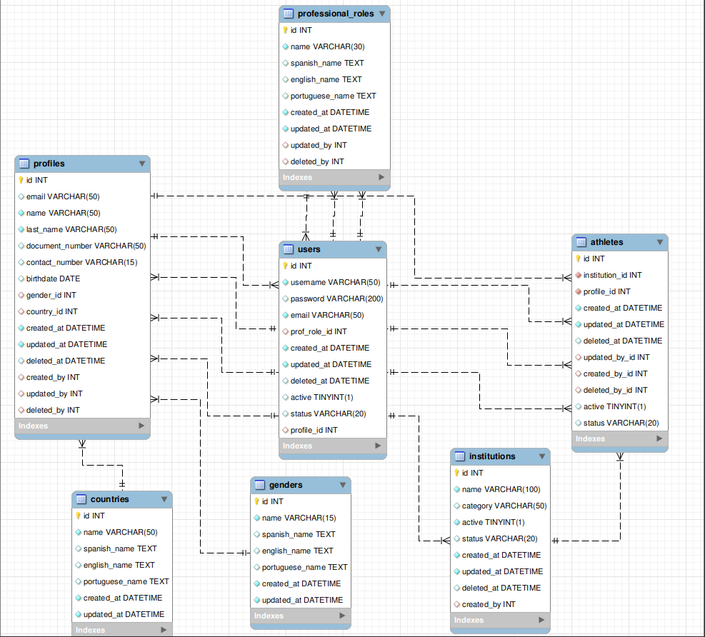
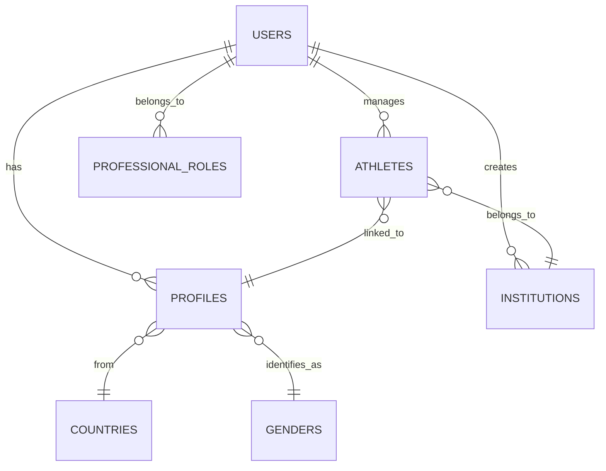

# 🧩 Athlete Management System

## 📘 Overview

The **Athlete Management System** is a modular, containerized API that manages institutions, users, athletes, and related profile data for sports organizations.  
It is designed to centralize athlete records, user, and institutional data while maintaining multilingual flexibility and scalable database access.

This project uses **FastAPI** for the web layer and **Peewee ORM** for database interaction.  
All data is persisted in a **MySQL** database and accessed through structured endpoints.

---

## 🏢 Business Context

This system supports **sports institutions** in organizing and managing their **athletes** and **staff members**.  
Each **institution** associated with a register users (administrators, coaches, etc.), who in turn can manage their athletes and related profile data.

Key entities:
- **Institutions** represent sports organizations.
- **Users** belong to institutions and have professional roles.
- **Profiles** store user and athlete personal data.
- **Athletes** are linked to institutions and profiles.
- **Countries** and **Genders** provide reference dimensions.
- **Professional Roles** define the hierarchy of users.

All entities are interconnected and can be visualized in the **Entity-Relationship Diagram (ERD)** below.

---

## 🗃️ Database Model (ERD)

The database was modeled with **Peewee ORM** and designed to ensure data consistency, normalization, and referential integrity.





## 🚀 API Endpoints

### 🧑‍💼 User Endpoints
| Method | Endpoint | Description |
|--------|-----------|-------------|
| `POST` | `/users/` | Create a user tied to an institution |
| `POST` | `/login/` | Authenticate a user |
| `GET` | `/healthcheck/` | Check API health status |
| `GET` | `/version/` | Retrieve system version |

---

### 🏃‍♂️ Athlete Endpoints
| Method   | Endpoint | Description |
|----------|-----------|-------------|
| `POST`   | `/athletes/` | Create an athlete |
| `GET`    | `/athletes/{id}` | Get athlete by ID |
| `GET`    | `/athletes/email/{email}` | Get athlete by email |
| `GET`    | `/athletes/` | Get all athletes |
| `PATCH`  | `/athletes/{id}` | Update athlete information |
| `DELETE` | `/athletes/{id}` | Delete athlete |
| `POST`   | `/athletes/upload/` | Upload a CSV with athlete data for the user’s institution |

---

### 👤 Profile Endpoints
| Method  | Endpoint | Description |
|---------|-----------|-------------|
| `GET`   | `/profiles/me` | Retrieve user profile |
| `PATCH` | `/profiles/me` | Update user profile |

---

### 🧭 Professional Role Endpoints
| Method | Endpoint | Description |
|--------|-----------|-------------|
| `GET` | `/roles/` | Get all professional roles |

---

### 🏫 Institution Endpoints
| Method | Endpoint | Description |
|--------|-----------|-------------|
| `PUT` | `/institutions/{id}` | Update institution information |

---

### 🚻 Gender Endpoints
| Method | Endpoint | Description |
|--------|-----------|-------------|
| `GET` | `/genders/` | Get gender list |

---

### 🌎 Country Endpoints
| Method | Endpoint | Description |
|--------|-----------|-------------|
| `GET` | `/countries/` | Get list of countries |

---

## 🧱 Project Structure

 ```
 app/
├── models/                 # Database models (Peewee ORM)
├── routers/                # FastAPI route definitions
├── services/               # Business logic separated from routes
├── schemas/                # Pydantic models for request/response validation
├── utils/                  # Reusable utilities and helpers
├── resources/
│   ├── postman_collection.json   # Example API collection
│   ├── database.sql              # MySQL schema
│   ├── erd_block.png             # ER diagram image
│   └── athletes_dataset.csv      # Example dataset (parsed before insert)
├── wait-for-it.sh                # Wait for DB before API start
├── start.sh                      # Launch FastAPI app
│
├── Dockerfile
├── docker-compose.yml
├── .env
└── main.py                       # FastAPI entrypoint
 ```

## 🛠️ Application Behavior

- The database is **automatically initialized** on startup if it doesn’t exist.
- A **seed script** loads essential data (countries, genders, roles).
- Logging is colorized for clearer debugging and log analysis.
- Middleware handles:
  - Automatic **database reconnection**
  - **Language localization**
- A **decorator** is available to apply pagination on list endpoints.
- authentication using **JWT**

---

## 🧾 Dataset Description

The provided CSV dataset (`resources/athletes_dataset.csv`) contains sample athletes linked to an institution.  
When uploaded through the API:
- The `birthdate` column is parsed into ISO `DATE` format.
- Each athlete is tied to the uploading user’s institution.
- The system prevents duplicate records by checking email and profile.

---

## 🐳 Docker Setup

The project is fully containerized with **Docker**.

### Build and Run

Before docker execution it must create a `.env` file with the following content:

```
# RUN_ENV=prod
RUN_ENV=dev
PYTHONPATH=/app

# Base de datos
MYSQL_ROOT_PASSWORD=admin
DB_NAME=db_ti
DB_USER=test
DB_PASS=test01
DB_HOST=database
DB_PORT=3306

# API
ACCESS_TOKEN_EXPIRE_MINUTES=1440
SECRET_KEY=aaIzZDc1ZTk2OGYyNmYzYmUzNDQzNTAzZWZlZmQ3NjFlMjJkNWUxNzNmZWE5NTY0NmEzNjU5ZTY3M2ViYjk3Yg==
DEPLOYMENT_SERVICE=local
#DEPLOYMENT_SERVICE=cloud

# Logs
FORMATTER=TXT
```

Now the docker is ready to be launched.

```
docker-compose up --build
```

### Environment variable explanation

| Variable       | Description                                                                                                                                                                                                                                                  |
| -------------- |--------------------------------------------------------------------------------------------------------------------------------------------------------------------------------------------------------------------------------------------------------------|
| **RUN_ENV**    | Indicates the current execution environment of the application. Common values are `dev` (development), `prod` (production), or `test`. It allows conditional logic such as using mock data, enabling debug logs, or stricter validation rules in production. |
| **PYTHONPATH** | Tells Python where to look for modules and packages. Setting it to `/app` ensures that when the application runs inside a Docker container, Python can correctly import internal modules (like `models`, `routers`, `services`, etc.).                       |
| **MYSQL_ROOT_PASSWORD** | Root password for the MySQL database instance (used by the database service inside Docker).                                                                                                                                                                  |
| **DB_NAME**             | Name of the main database schema used by the application. To this name the RUN_ENV varaible will be added as the complete name (in this case, `db_ti_dev`).                                                                                                  |
| **DB_USER**             | MySQL username the app will use to connect to the database.                                                                                                                                                                                                  |
| **DB_PASS**             | Password for the above MySQL user.                                                                                                                                                                                                                           |
| **DB_HOST**             | Hostname of the database server. Inside Docker Compose, `database` refers to the MySQL service container.                                                                                                                                                    |
| **DB_PORT**             | TCP port where MySQL listens. Default for MySQL is `3306`.                                                                                                                                                                                                   |
| **ACCESS_TOKEN_EXPIRE_MINUTES**  | Duration (in minutes) for which an access token remains valid. `1440` = 24 hours. Used for short-lived authentication tokens (JWT). |
| **SECRET_KEY**                   | Cryptographic key used to sign and verify access tokens (JWTs). Should be long, random, and kept secret.                            |
| **DEPLOYMENT_SERVICE**           | Indicates where the app is deployed: `local` for Docker/local machine or `cloud` for production deployments (e.g., AWS, GCP).       |
| **FORMATTER** | Defines the log output format. Can be `TXT` (plain text, colorized) or `JSON` (structured logs suitable for cloud monitoring systems). The app’s logging configuration module reads this value to set up the logging handler accordingly. |

---

## 🧪 Testing Flow

This section describes the recommended order to test the API endpoints and verify the full system functionality — from basic data retrieval to athlete management and CSV upload.

Each step can be tested using **Postman** (a collection is provided under the `resources/postman_collection` folder).

---

### 🔹 Step 1 – Get Gender List

**Endpoint:** `GET /gender/`
Retrieve all genders available in the system.
You will need a valid `gender_id` to create a user profile.

---

### 🔹 Step 2 – Get Country List

**Endpoint:** `GET /country/`
Retrieve all supported countries.
The returned `country_id` will be required when creating a new user.

---

### 🔹 Step 3 – Get Professional Roles

**Endpoint:** `GET /professional_roles/`
Fetch all available professional roles in the system.
Keep the `id` value to associate it with the new user being created.

---

### 🔹 Step 4 – Create User

**Endpoint:** `POST /user/`
Create a new user by providing:

* `username`
* `password`
* `email`
* `gender_id`
* `country_id`
* `professional_role_id`
* `institution_id`

The user is tied to a specific institution.

---

### 🔹 Step 5 – Login

**Endpoint:** `POST /user/login/`
Authenticate the user using `email` and `password` to obtain a valid **JWT token**.
This token must be included in the `Authorization` header for all protected endpoints:

```bash
Authorization: Bearer <your_access_token>
```

---

### 🔹 Step 6 – Get User Profile

**Endpoint:** `GET /profile/`
Retrieve the current user's profile information.

---

### 🔹 Step 7 – Update Profile Information

**Endpoint:** `PATCH /profile/`
Update user profile fields such as:

* `email`
* `name`
* `last_name`
* `document_number`
* `contact_number`
* `birthdate`
* `gender_id`
* `country_id`


---

### 🔹 Step 8 – Create Athlete

**Endpoint:** `POST /athlete/`
Register a new athlete under the current user’s institution.
Required fields include:

* `email`
* `name`
* `last_name`
* `document_number`
* `contact_number`
* `birthdate`
* `gender_id`
* `country_id`

---

### 🔹 Step 9 – Get All Athletes

**Endpoint:** `GET /athlete/`
Retrieve all athletes associated with the user’s institution.

---

### 🔹 Step 10 – Get Athlete by ID

**Endpoint:** `GET /athlete/{athlete_id}`
Return detailed information about a specific athlete.

---

### 🔹 Step 11 – Get Athlete by Email

**Endpoint:** `GET /athlete/email/{email}`
Search for an athlete by email address.

---

### 🔹 Step 12 – Update Athlete Information

**Endpoint:** `PATCH /athletes/{athlete_id}`
Modify any athlete field such as:

* `email`
* `name`
* `last_name`
* `document_number`
* `contact_number`
* `birthdate`
* `gender_id`
* `country_id`

---

### 🔹 Step 13 – Delete Athlete

**Endpoint:** `DELETE /athlete/{athlete_id}`
Soft delete an athlete record (marks it as inactive and sets deletion metadata).

---

### 🔹 Step 14 – Update Institution Name

**Endpoint:** `PATCH /institution/{institution_id}`
Update the institution name to match one from the **`athletes.csv`** dataset.
This ensures consistency before uploading the dataset.

---

### 🔹 Step 15 – Upload Athletes from CSV Dataset

**Endpoint:** `POST /athlete/upload_athletes/`
Upload the `athletes.csv` dataset provided in `resources/datasets/`.
The dataset will be parsed and stored in the corresponding database tables.
The `birthdate` field will be automatically normalized using a date parser function.

---

## 🧰 Tech Stack

| Component            | Technology              |
| -------------------- |-------------------------|
| **Framework**        | FastAPI                 |
| **ORM**              | Peewee                  |
| **Database**         | MySQL                   |
| **Containerization** | Docker & Docker Compose |
| **Language**         | Python 3.13            |


## 🛠️ Solution Improvements

- A new table to link user with institutions that will allow more than one institution per user (1 to many).
- Create athletes just for the own institution, but it needs the previous statement.
